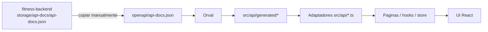

# Arquitectura Frontend

## Rol en el sistema
`fitness-frontend` es el consumer del contrato API. Implementa una SPA React que consume el backend Laravel mediante HTTP con autenticacion por cookie stateful (Sanctum).

## Stack
- React 19 + TypeScript 6
- Vite 8
- React Router 7
- Redux Toolkit
- Axios
- Tailwind CSS 4
- Vitest + Testing Library

## Flujo de integracion

`fitness-backend` es dueño del contrato (behavior/tests -> OpenAPI). El
spec se copia manualmente a este repo (no hay checkout cruzado en CI, ya
que `fitness-backend` es un repo privado separado):

Orden de autoridad: comportamiento/tests del backend -> OpenAPI -> cliente
Orval -> adaptadores delgados en `src/api/*.ts` -> componentes. El
consumidor nunca inventa endpoints ni payloads.

## Estructura principal
- `src/api`: adaptadores delgados sobre el cliente generado, mas
  cliente HTTP (`client.ts`), normalizacion de errores (`errors.ts`) y
  el bus de eventos de sesion (`apiEvents.ts`).
- `src/api/generated`: cliente tipado generado por Orval (no editar a mano).
- `src/api/mutator.ts`: instancia axios personalizada usada por Orval en
  vez del axios por defecto, para reusar interceptores/baseURL/credentials.
- `src/pages`: paginas por feature (auth, onboarding, dashboard, foods,
  diary, library, recipes, reports, profile, account, admin).
- `src/router`: definicion de rutas y guards (`RequireAuth`, `RequireGuest`,
  `RequireAdmin`).
- `src/store`: estado global (autenticacion + consentimiento requerido).
- `src/components`: componentes UI reutilizables, incluyendo
  `NutrientValue`/`NutrientStatusLegend` para el manejo honesto de
  nutrientes desconocidos/parciales (nunca se coacciona a 0).
- `src/test`: infraestructura MSW (`server.ts`, `handlers/`) para tests de
  componentes/integracion.
- `e2e`: specs de Playwright contra un backend real sembrado.

## Seguridad de sesion
- `withCredentials: true` en Axios.
- Inicializacion CSRF via `/sanctum/csrf-cookie`.
- Reintento automatico en `419` tras renovar cookie CSRF.
- Eventos `session-expired` (401) y `consent-required` (409 +
  `CONSENT_REQUIRED`) via interceptor de respuesta, consumidos en
  `AppInit.tsx` para despachar al store.
- Normalizacion de parametros booleanos en query strings (`true`/`false` ->
  `'1'`/`'0'`) en un interceptor de request, porque la regla `boolean` de
  Laravel solo acepta esos literales, no las palabras.

## Pruebas
- Unit/integration tests con Vitest + Testing Library + MSW
  (`src/test/server.ts`) para slices, guards, adaptadores de API y flujos
  de autenticacion/consentimiento.
- Tests de interceptores HTTP con `axios-mock-adapter` (capa distinta a
  MSW: reemplaza el adapter de axios antes de que la interceptacion de red
  de MSW aplique).
- E2E con Playwright (`e2e/`) contra un backend real sembrado, configurable
  via `BASE_URL`.
- Comandos: `npm run test`, `npm run test:e2e`, `npm run lint`,
  `npm run typecheck`, `npm run contract:check`, `npm run build`.

## CI
- `.github/workflows/ci.yml`: jobs `static` (lint + typecheck +
  contract:check), `unit` (test) y `build`, sin secretos.
- El job `e2e` no esta en CI: requeriria un `fitness-backend` sembrado
  (MySQL) accesible desde el workflow, y ese repo es privado y separado —
  agregarlo hoy implicaria un secreto de checkout cruzado. Se ejecuta
  localmente con `npm run test:e2e` contra un backend sembrado a mano.

## Estado actual
- Build en verde.
- Tests frontend en verde (Vitest + MSW).
- Integracion con OpenAPI owner-consumer activa, contrato vendorizado en
  `openapi/api-docs.json`.
