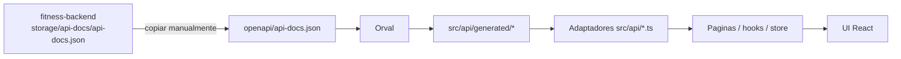

# Arquitectura Frontend

## Rol en el sistema
`fitness-frontend` es el consumer del contrato API. Implementa una SPA React que consume el backend Laravel mediante HTTP con autenticacion por cookie stateful (Sanctum).

## Stack
- React 19 + TypeScript 6
- Vite 8
- React Router 7
- Redux Toolkit
- Axios
- Tailwind CSS 4
- Vitest + Testing Library

## Flujo de integracion

`fitness-backend` es dueño del contrato (behavior/tests -> OpenAPI). El
spec se copia manualmente a este repo (no hay checkout cruzado en CI, ya
que `fitness-backend` es un repo privado separado):

Orden de autoridad: comportamiento/tests del backend -> OpenAPI -> cliente
Orval -> adaptadores delgados en `src/api/*.ts` -> componentes. El
consumidor nunca inventa endpoints ni payloads.

## Estructura principal
- `src/api`: adaptadores delgados sobre el cliente generado, mas
  cliente HTTP (`client.ts`), normalizacion de errores (`errors.ts`) y
  el bus de eventos de sesion (`apiEvents.ts`).
- `src/api/generated`: cliente tipado generado por Orval (no editar a mano).
- `src/api/mutator.ts`: instancia axios personalizada usada por Orval en
  vez del axios por defecto, para reusar interceptores/baseURL/credentials.
- `src/pages`: paginas por feature (auth, onboarding, dashboard, foods,
  diary, library, recipes, reports, profile, account, admin).
- `src/router`: definicion de rutas y guards (`RequireAuth`, `RequireGuest`,
  `RequireAdmin`).
- `src/store`: estado global (autenticacion + consentimiento requerido).
- `src/components`: componentes UI reutilizables, incluyendo
  `NutrientValue`/`NutrientStatusLegend` para el manejo honesto de
  nutrientes desconocidos/parciales (nunca se coacciona a 0).
- `src/test`: infraestructura MSW (`server.ts`, `handlers/`) para tests de
  componentes/integracion.
- `e2e`: specs de Playwright contra un backend real sembrado.

## Seguridad de sesion
- `withCredentials: true` en Axios.
- Inicializacion CSRF via `/sanctum/csrf-cookie`.
- Reintento automatico en `419` tras renovar cookie CSRF.
- Eventos `session-expired` (401) y `consent-required` (409 +
  `CONSENT_REQUIRED`) via interceptor de respuesta, consumidos en
  `AppInit.tsx` para despachar al store.
- Normalizacion de parametros booleanos en query strings (`true`/`false` ->
  `'1'`/`'0'`) en un interceptor de request, porque la regla `boolean` de
  Laravel solo acepta esos literales, no las palabras.

## Pruebas
- Unit/integration tests con Vitest + Testing Library + MSW
  (`src/test/server.ts`) para slices, guards, adaptadores de API y flujos
  de autenticacion/consentimiento.
- Tests de interceptores HTTP con `axios-mock-adapter` (capa distinta a
  MSW: reemplaza el adapter de axios antes de que la interceptacion de red
  de MSW aplique).
- E2E con Playwright (`e2e/`) contra un backend real sembrado, configurable
  via `BASE_URL`.
- Comandos: `npm run test`, `npm run test:e2e`, `npm run lint`,
  `npm run typecheck`, `npm run contract:check`, `npm run build`.

## CI
- `.github/workflows/ci.yml`: jobs `static` (lint + typecheck +
  contract:check), `unit` (test) y `build`, sin secretos.
- El job `e2e` no esta en CI: requeriria un `fitness-backend` sembrado
  (MySQL) accesible desde el workflow, y ese repo es privado y separado —
  agregarlo hoy implicaria un secreto de checkout cruzado. Se ejecuta
  localmente con `npm run test:e2e` contra un backend sembrado a mano.

## Sprint 3 — Calidad de dieta
- `/reports` usa `ReportsLayout` con tabs (Nutrición / Calidad de dieta) para
  mantener la navegación primaria en 5 items.
- Páginas en `src/pages/quality/`: `DietQualityPage` (summary, historial con
  tabla accesible, focus candidates, metas + progreso),
  `DietQualityAssessmentPage` (wizard de 1 pregunta por paso, respuestas solo
  en memoria — nunca localStorage — y manejo del 409
  `INSTRUMENT_VERSION_OUTDATED` recargando el instrumento),
  `DietQualityAssessmentDetailPage`, y modales `DietQualityGoalModal` /
  `DietQualityCheckInModal`.
- Copy fijo en `src/pages/quality/copy.ts` (disclaimer, aviso de alcohol,
  labels neutrales de comparación de progreso).
- `DietQualityCard` en el dashboard consulta `summary(30)` y se oculta si el
  módulo no carga. El score nunca se recalcula en el cliente.

## Sprint 4 — Micronutrientes
- Adapter `src/api/nutrients.ts` (catalogo, referencias DRI, ingesta diaria,
  ingesta por periodo, detalle de nutriente), delgado sobre el cliente
  generado (`src/api/generated/nutrients`), sin interfaces de backend
  escritas a mano.
- Tercer tab "Nutrientes" en `ReportsLayout` (`/reports/nutrients` y
  `/reports/nutrients/:code`), junto a Nutrición y Calidad de dieta.
  Páginas en `src/pages/reports/`: `NutrientReportPage.tsx`,
  `NutrientDetailPage.tsx`.
- Componentes en `src/components/nutrition/`: `NutrientCoverageBadge`,
  `NutrientReferenceLabel`, `NutrientComparisonText`,
  `NutrientQualityBreakdown`, `NutrientReferenceExplanation`,
  `NutrientDataLimitations` (ademas de `NutrientValue`/
  `NutrientStatusLegend` de sprints previos).
- `MicronutrientsCard` en el dashboard (`src/pages/dashboard/`): conteos
  completo/parcial/sin-datos, sin ranking de "peores nutrientes".
- `FoodDetailPage` extendida con 4 secciones por 100g (Macronutrientes y
  energía, Fibra y sodio, Vitaminas, Minerales), cada fila con estado de
  calidad y fuente, nunca sustituyendo valores faltantes por 0.
- `MyFoodFormModal` extendido con sección colapsable "Micronutrientes
  opcionales" (10 campos; en blanco = desconocido, 0 = cero real).
- `RecipeEditorPage`: avisos de disponibilidad de micronutrientes por
  ingrediente (solo informativos; el preview autoritativo lo sigue
  calculando el servidor). `RecipeDetailPage`: tabla agrupada Por
  receta/Por 100g/Por porción/Estado, sin comparación contra referencia
  (fuera de alcance en detalle de receta).
- Gap de alcance conocido (documentado, no es un bug): los endpoints admin
  de creación/edición de alimentos (`AdminCreateFoodBody`/
  `AdminUpdateFoodBody`) no fueron extendidos por el backend en Sprint 4
  con `nutrients`/`nutrition_basis`, así que el formulario admin de
  alimentos sigue con los 6 campos macro legados únicamente.
- `Modal.tsx` (`src/components/ui/`) recibió un fix de scroll interno
  (`max-h-[calc(100vh-2rem)]` + área de contenido con `overflow-y-auto`)
  para que modales altos, como el formulario de alimento con la sección de
  micronutrientes expandida, no empujen el botón de submit fuera del
  viewport.
- E2E: `e2e/nutrients.spec.ts` cubre flujo de usuario (detalle de alimento
  completo/parcial, alimento propio con calcio+hierro=0 y vitamina D en
  blanco, receta mixta con estado parcial, diario, dashboard card, reportes
  de 30 días, detalle de nutriente, referencia por rango cuando el perfil
  no divulga datos, export 4.0.0, revocación/reaceptación de consentimiento)
  y flujo admin (mapeos FDC de sistema bloqueados, 422 en intento de mapeo
  incompatible, sin exposición de API key). Nunca llama a FDC real.

## Estado actual
- Build en verde.
- Tests frontend en verde (Vitest + MSW).
- Integracion con OpenAPI owner-consumer activa, contrato vendorizado en
  `openapi/api-docs.json`.
