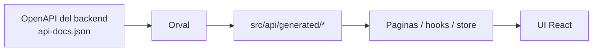

# Arquitectura Frontend

## Rol en el sistema
`fitness-frontend` es el consumer del contrato API. Implementa una SPA React que consume el backend Laravel mediante HTTP con autenticacion por cookie stateful (Sanctum).

## Stack
- React 19 + TypeScript 6
- Vite 8
- React Router 7
- Redux Toolkit
- Axios
- Tailwind CSS 4
- Vitest + Testing Library

## Flujo de integracion

## Estructura principal
- `src/api`: cliente HTTP y modulos de acceso a API.
- `src/api/generated`: cliente tipado generado por Orval.
- `src/pages`: paginas por feature (auth, onboarding, dashboard, foods, diary, profile, account, admin).
- `src/router`: definicion de rutas y guards (`RequireAuth`, `RequireGuest`, `RequireAdmin`).
- `src/store`: estado global de autenticacion.
- `src/components`: componentes UI reutilizables.

## Seguridad de sesion
- `withCredentials: true` en Axios.
- Inicializacion CSRF via `/sanctum/csrf-cookie`.
- Reintento automatico en `419` tras renovar cookie CSRF.

## Pruebas
- Unit tests con Vitest para slices y guards.
- Comandos: `npm run test`, `npm run lint`, `npm run build`.

## Estado actual
- Build en verde.
- Tests frontend en verde (Vitest).
- Integracion con OpenAPI owner-consumer activa.
